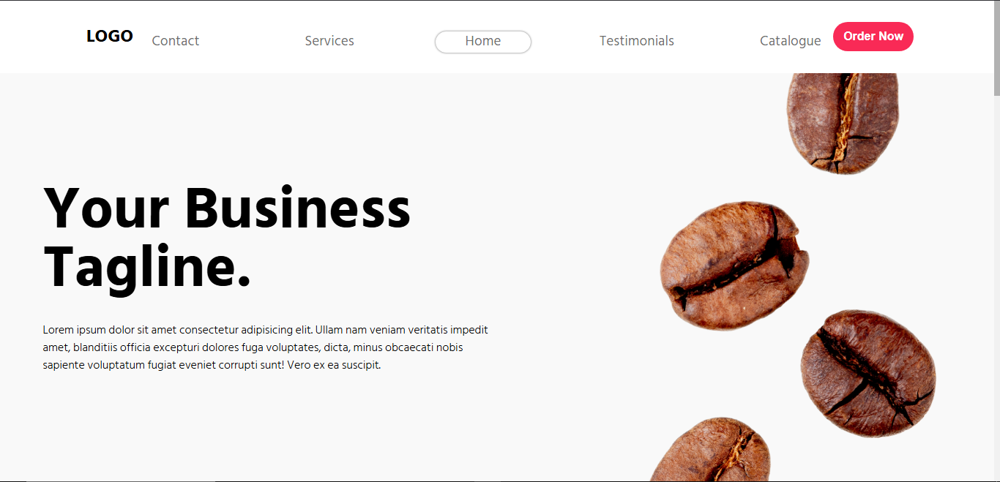

# ☕ Coffee Shop Landing Page

A sleek and responsive landing page for a coffee business. Designed with a clean aesthetic, bold typography, and a focus on user experience to help drive conversions and orders.

## 🚀 Features

- 🖥️ Responsive design for desktop and mobile
- 🍽️ Sections for Contact, Services, Testimonials, and Catalogue
- 📍 Sticky navigation bar with smooth scrolling
- 📦 Optimized images and fast loading
- 💻 Built using HTML, CSS, and JavaScript

## 📸 Preview



## 🛠️ Tech Stack

- **HTML5** – Semantic and clean structure
- **CSS3** – Flexbox and responsive layout
- **JavaScript** – Interactive elements


## 🧠 Inspiration

Inspired by minimalist and product-focused landing pages designed to capture attention quickly and convert visitors to customers.

## 📝 Customization

Want to use it for your own shop?
- Replace images in `/images`
- Update text in `index.html`
- Adjust colors/fonts in `styles.css`

## 📦 Setup

To run locally:

```bash
git clone https://github.com/Aarush625/Fictional-Coffee-Shop-Landing-Page.git
cd coffee-website
open index.html


